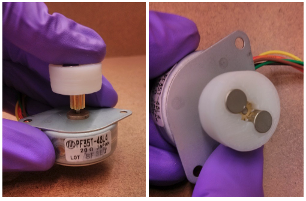

# Magnetic stirrer

## Parts

- 2x | magnets | ~ 10.0 USD | [link](https://www.amazon.com/-/es/refrigerador-peque%C3%B1os-redondos-cilindro-oficina/dp/B07873ZCY4/ref=sr_1_31?__mk_es_US=%C3%85M%C3%85%C5%BD%C3%95%C3%91&dchild=1&keywords=neodymium+magnet+disc&qid=1635234373&sr=8-31)

- 1x | 12V DC motor | [link](https://www.amazon.com/-/es/Motor-0-945-Modelo-Juguetes-Paquete/dp/B01M0XOOS5/ref=sr_1_8?__mk_es_US=%C3%85M%C3%85%C5%BD%C3%95%C3%91&dchild=1&keywords=12V+DC+motor+Arduino+compatible&qid=1635235710&sr=8-8)

(https://www.amazon.com/-/es/refrigerador-peque%C3%B1os-redondos-cilindro-oficina/dp/B07873ZCY4/ref=sr_1_31?__mk_es_US=%C3%85M%C3%85%C5%BD%C3%95%C3%91&dchild=1&keywords=neodymium+magnet+disc&qid=1635234373&sr=8-31)