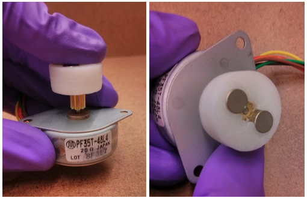

# Chemostat

Our aim is to fabricate a small chemostat (working volume ~ 20 ml) able to read the cellular density (DO) in real time and having a "well enough" control over the dilution rate.
It is also desirable to have some multiplexing capacities (multiple culture chambers) for running parallel replicas.

----

## DO measurement

----

The DO system that will be used to measure in real time the growth rate is inspired in the system described at [10.1021/sb500165g](10.1021/sb500165g)

I'm also wants to implement this simple signal processing model described at [10.1371/journal.pone.0181923](10.1371/journal.pone.0181923).

"The employed Kalman filtering approach based on a very general state model retains the flexibility of the used control type and can be easily adapted to other bioreactor designs. Within several minutes it can converge to robust, accurate growth rate estimates"

### Required Parts (Per culture chamber)

- 1 unit | Laser module 1 mW LFD650 | ~€10.0 | [link](https://www.conrad.com/p/laserfuchs-laser-module-dot-red-1-mw-lfd650-1-12-9-x-20-1695487)

- 2 units | light-to-frequency converter TSL | ~€4.0 | [link](https://www.conrad.com/p/tsl-235-r-light-to-frequency-converter-tsl-235-r-case-type-tht-10-5-v-178993)

----

## Pump system

----

The second important feature we want to address is a good control of the chemostat dilution rate.

There are two main options for pumping systems. Peristaltic pumps and syringe pump.

----

### Syringe pump

I do prefer the syringe pump because it can be used for liquids and/or gasses, it developed higher pressures, it allows to reliably compute the flow by counting the number of cycles (the volume of the syringe is known and constant) and finally, by using different syringes we can change the working volume range with the same motor and control systems. The main disadvantage is that it additionally requires the uses of pitch valves, although I am exploring using [one way check valves](https://en.wikipedia.org/wiki/Check_valve) instead.

Image taken from [http://dx.doi.org/10.1021/sb500165g](http://dx.doi.org/10.1021/sb500165g)

#### Required Parts (per pump)

- 1 unit | Reversible High torque Turbo Worm Gear Motor DC 12V 10RPM | ~ 15.00 USD | [link](https://www.banggood.com/Reversible-High-torque-Turbo-Worm-Gear-Motor-JGY370-DC-12V-10RPM-p-1051928.html?cur_warehouse=CN&rmmds=buy)

- (Alternatively) Servo | ~ 15.00 USD | [link](https://www.amazon.com/-/es/Hitec-32645S-HS-645MG-Torque-engranaje/dp/B003T6RSVQ)

- Plastic Rack & Pinion Gears | ~ 5.00 USD | [link](https://es.aliexpress.com/item/32400417811.html?spm=a2g0o.search0304.0.0.47b913b8W4AmZ1&algo_pvid=f01031e1-eb6c-477d-a3e0-f3294e5688d1&algo_exp_id=f01031e1-eb6c-477d-a3e0-f3294e5688d1-24), [link](https://es.aliexpress.com/item/1005003277679101.html?spm=a2g0o.productlist.0.0.230644acHTD5QG&algo_pvid=16b7aa9d-2348-4cb4-bebb-5227dd189ac6&algo_exp_id=16b7aa9d-2348-4cb4-bebb-5227dd189ac6-59&pdp_ext_f=%7B%22sku_id%22%3A%2212000024986889912%22%7D)

----

### Peristaltic Pump

This pump system have the advantage of being simpler, but it is harder to control the dilution rate without having a feedback system.
Additionally, it is for liquids mainly.

#### Required Parts (per pump) 

- 1 unit | Peristaltic Pump | ~ 10.00 - 30.00 USD | [link](https://www.amazon.com/-/es/INTLLAB-dosificadora-perist%C3%A1ltico-laboratorio-anal%C3%ADtico/dp/B0791YL351/ref=sr_1_4?__mk_es_US=%C3%85M%C3%85%C5%BD%C3%95%C3%91&dchild=1&keywords=peristaltic+pump+arduino&qid=1635818338&sr=8-4)

----

## Magnetic stirrer

----

We need to provide a well mixing environment in the culture chamber.
To provide that we can use a magnetic stirrer

### Required parts (per stirrer)

- 2 units | magnets | ~ 10.0 USD | [link](https://www.amazon.com/-/es/refrigerador-peque%C3%B1os-redondos-cilindro-oficina/dp/B07873ZCY4/ref=sr_1_31?__mk_es_US=%C3%85M%C3%85%C5%BD%C3%95%C3%91&dchild=1&keywords=neodymium+magnet+disc&qid=1635234373&sr=8-31)

- 1 unit | 12V DC motor | [link](https://www.amazon.com/-/es/Motor-0-945-Modelo-Juguetes-Paquete/dp/B01M0XOOS5/ref=sr_1_8?__mk_es_US=%C3%85M%C3%85%C5%BD%C3%95%C3%91&dchild=1&keywords=12V+DC+motor+Arduino+compatible&qid=1635235710&sr=8-8)

- 1 unit | Magnetic Spinbar | ~ 10.0 USD | [link](https://www.amazon.com/Magnetic-Stirrer-Mixer-Spinbar-Stirring/dp/B01ISMV5G4?psc=1&pd_rd_w=NPUGW&pf_rd_p=c9b3a448-7c3c-4399-ac60-2bdc98844f72&pf_rd_r=MHQM3BPQ0MHWZQVY1N4E&pd_rd_r=92a2a093-b8af-4f21-a5ac-e481774bb1fd&pd_rd_wg=anwuT&ref_=sspa_dk_rhf_detail_pt_sub_2&spLa=ZW5jcnlwdGVkUXVhbGlmaWVyPUFJQlY3VkU5MlpISFQmZW5jcnlwdGVkSWQ9QTA3NzY2MjcxUTIxRkdMOTFEV0dFJmVuY3J5cHRlZEFkSWQ9QTAyMTE2NTkzTVEySjhOQ0RRN0g3JndpZGdldE5hbWU9c3BfcmhmX2RldGFpbCZhY3Rpb249Y2xpY2tSZWRpcmVjdCZkb05vdExvZ0NsaWNrPXRydWU=)

----

## Pinch valve

----

The pinch valve allows to use a single pump to feed several cultures.
Those are required for multiplexing and the syringe pump system.

### Design examples

1. example [link](https://www.youtube.com/watch?v=Fx_Uw13eh48)

2. example (my favorite) [link](https://www.youtube.com/watch?v=4raXnoKUtow)

3. example [link](http://depts.washington.edu/soslab/turbidostat/pmwiki/pmwiki.php?n=ConstructionManual.PinchValve)

### Required Parts (per valve)

- servo motor | ~ 4.00 USD | [link](https://altronics.cl/micro-servo-mg90s)

----

## Others

----

- Cables | [link](https://www.amazon.com/Elegoo-EL-CP-004-Multicolored-Breadboard-arduino/dp/B01EV70C78?psc=1&pd_rd_w=3dTu2&pf_rd_p=c9b3a448-7c3c-4399-ac60-2bdc98844f72&pf_rd_r=AM01CNZ1W1SGX9V5KS8H&pd_rd_r=527377dd-a330-4203-b019-5817de38ca2c&pd_rd_wg=vN8nH&ref_=sspa_dk_rhf_detail_pt_sub_15&spLa=ZW5jcnlwdGVkUXVhbGlmaWVyPUEyWE81SUc2RkcwNUYmZW5jcnlwdGVkSWQ9QTAxMzUyNzRVUDNTNktGTUtDVEsmZW5jcnlwdGVkQWRJZD1BMDY2NjMyNkNaSzJFSEE5RjVYWiZ3aWRnZXROYW1lPXNwX3JoZl9kZXRhaWwmYWN0aW9uPWNsaWNrUmVkaXJlY3QmZG9Ob3RMb2dDbGljaz10cnVl)

- Cables ties | [link](https://www.amazon.com/TR-Industrial-TR88301-Multi-Purpose-Cable/dp/B01018DB2E/ref=sr_1_1?dchild=1&keywords=mini+zip+ties&qid=1635230808&sr=8-1)

- 1 unit | 12V power supply | ~€10.0 | missing