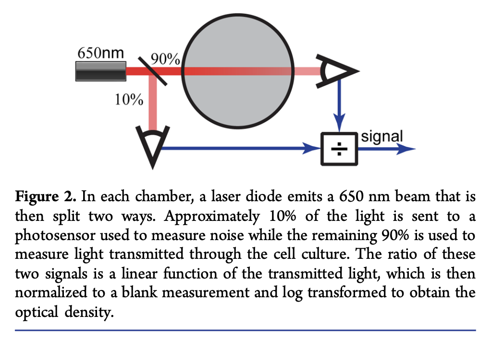

# DO System

The DO system that will be used to measure in real time the growth rate is inspired in the system described at [10.1021/sb500165g](10.1021/sb500165g)

I'm also wants to implement this simple signal processing model described at [10.1371/journal.pone.0181923](10.1371/journal.pone.0181923).

"The employed Kalman filtering approach based on a very general state model retains the flexibility of the used control type and can be easily adapted to other bioreactor designs. Within several minutes it can converge to robust, accurate growth rate estimates"

## Required Parts

Required among | Part name | approx price per unit | buy link proposal

### Per culture chamber

- 1x | Laser module 1 mW LFD650 | ~€10.0 | [link](https://www.conrad.com/p/laserfuchs-laser-module-dot-red-1-mw-lfd650-1-12-9-x-20-1695487)

- 2x | light-to-frequency converter TSL | ~€4.0 | [link](https://www.conrad.com/p/tsl-235-r-light-to-frequency-converter-tsl-235-r-case-type-tht-10-5-v-178993)

### Global

- 1x | 12V power supply | ~€10.0 | missing
