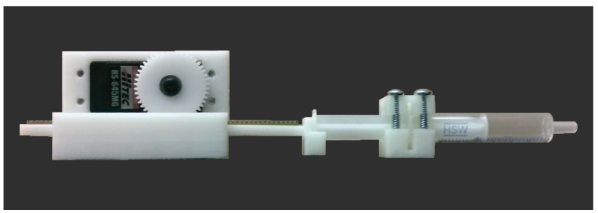

# Pumps

There are two main options for pumping systems. Peristaltic pumps and syringe pump.
I do prefer the syringe pump because it can be used for liquids and/or gasses, it developed higher pressures, it allows to reliably compute the flow by counting the number of cycles (the volume of the syringe is known and constant) and finally, by using different syringes we can change the working volume range with the same motor and control systems. The main disadvantage is that it additionally requires the uses of pitch valves, although I am exploring using [one way check valves](https://en.wikipedia.org/wiki/Check_valve) instead.

## Syringe pump

Image taken from [link](http://dx.doi.org/10.1021/sb500165g)

### Required Parts

Required among | Part name | approx price per unit | buy link proposal

#### Per pump

- Reversible High torque Turbo Worm Gear Motor DC 12V 10RPM | ~ 15.00 USD | [link](https://www.banggood.com/Reversible-High-torque-Turbo-Worm-Gear-Motor-JGY370-DC-12V-10RPM-p-1051928.html?cur_warehouse=CN&rmmds=buy)

- (Alternatively) Servo | ~ 15.00 USD | [link](https://www.amazon.com/-/es/Hitec-32645S-HS-645MG-Torque-engranaje/dp/B003T6RSVQ)

- Plastic Rack & Pinion Gears | ~ 5.00 USD | [link](https://es.aliexpress.com/item/32400417811.html?spm=a2g0o.search0304.0.0.47b913b8W4AmZ1&algo_pvid=f01031e1-eb6c-477d-a3e0-f3294e5688d1&algo_exp_id=f01031e1-eb6c-477d-a3e0-f3294e5688d1-24), [link](https://es.aliexpress.com/item/1005003277679101.html?spm=a2g0o.productlist.0.0.230644acHTD5QG&algo_pvid=16b7aa9d-2348-4cb4-bebb-5227dd189ac6&algo_exp_id=16b7aa9d-2348-4cb4-bebb-5227dd189ac6-59&pdp_ext_f=%7B%22sku_id%22%3A%2212000024986889912%22%7D)

## Peristaltic Pump

- [interesting](https://www.amazon.com/-/es/refrigerador-peque%C3%B1os-redondos-cilindro-oficina/dp/B07873ZCY4/ref=sr_1_31?__mk_es_US=%C3%85M%C3%85%C5%BD%C3%95%C3%91&dchild=1&keywords=neodymium+magnet+disc&qid=1635234373&sr=8-31)